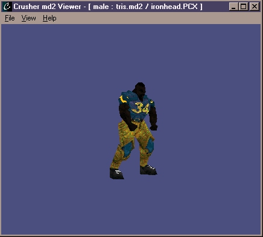

# Crusher md2 Model Viewer


The Crusher md2 model viewer displays the 3D model files from Quake 2. It is not hardware accelerated and does not require the installation of an API such as DirectX or OpenGL.

Crusher allows the loading and displaying of md2 model files. The models are displayed in three dimensions and can be rotated and moved in the viewer. The program can also read and display 256 color PCX texture files. In addition to textured mode, the viewer features wireframe and flat shading modes.

## Screenshots

 



## Instructions

Use the left and right arrows to step and back through the frames.

Press and hold the left mouse to rotate the model.

`CTRL+W`	- toggles wireframe mode

`C`		- recenters the model

## Command Line Options

The following options are accepted as command line
options:

| Argument                | Description                          |
| -----------------------:| ------------------------------------ |
| `-model filename`       | loads the model file                 |
| `-skin filename`        | loads the skin file                  |
| `-xrot value`           | rotates about x-axis by value amount |
| `-yrot value`	          | rotates about y-axis by value amount |
| `-zrot value`	          | rotates about z-axis by value amount |
| `-wireframe`            | sets the viewer to wireframe mode    |
| `-flatshade`            | set the viewer to flatshading mode   |
| `-h, -help, -?`         | displays this screen                 |
| `-v, -V, -version`      | displays the program version number  |


## Exporting to Unreal I Format

1. Make a new folder below the Unreal directory, for example `Unreal\Hazard`
```
Unreal\
 +- Hazard
 +- Cache
 +- System
 +- ...
```
2. In this folder, create two news folder `Classes` and `Models`
```
Unreal\Hazard
 +- Classes
 +- Models
```
3. Use Crusher to export the model to Unreal format. This creates the needed `*.3d` and
   `*.pcx` files to the `Models` folder. Also, a `*.uc` script is created in the `Classes`
   folder.

4. Change to the `Unreal\System` directory. The next three steps will take place there.

5. Locate the `Unreal.ini` file. In the `[Editor.EditorEngine]` section add `Hazard` to
   the `[EditPackages]` list. e.g. `EditPackages[8]=Hazard`

6. In the `Unreal\System` directory delete the `Hazard.u` file if it exists

7. Type `Unreal -make` to build the `Hazard.u` file.

8. If Unreal completes the build without error, the model is in the game. Otherwise, check
   the `Unreal.log` file to investigate problems.

### Notes

* To change the Unreal Project folder, modify line 113 in file `defs.h`
* Unreal has problems importing skins that are not powers of two

